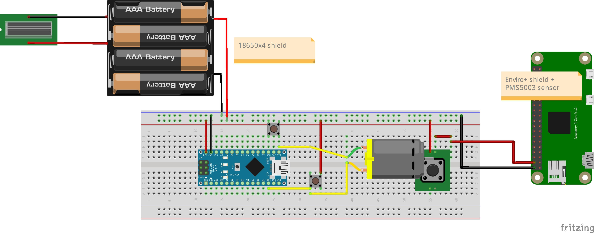
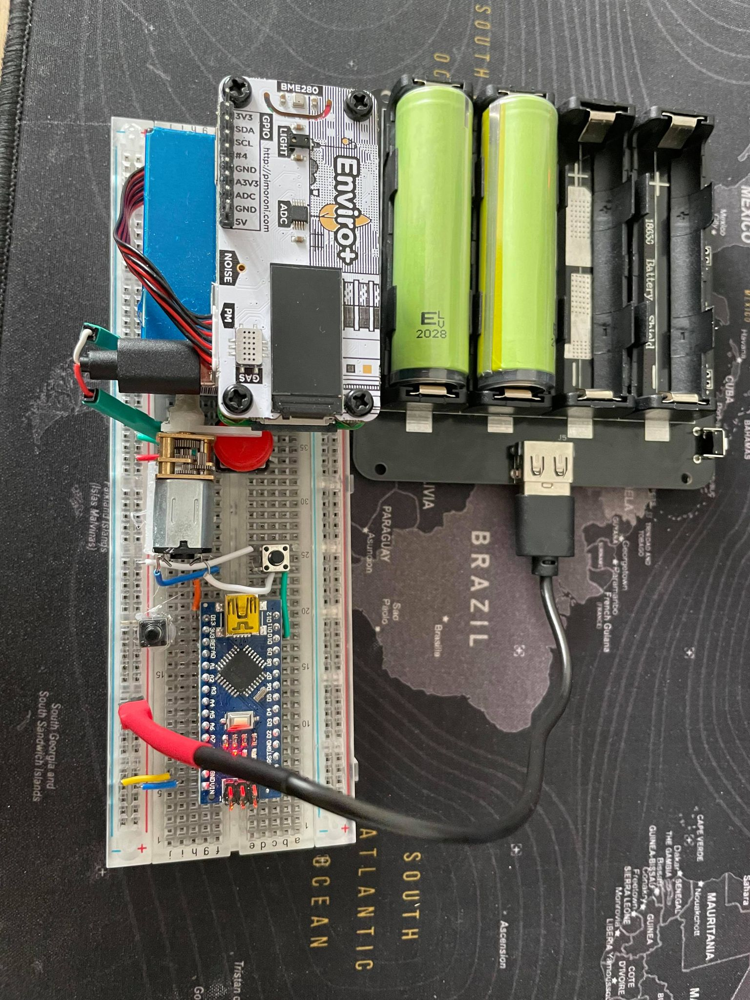

# Air-quality-sensor
Air quality sensor - RPi + arduino

# Components
- 10W solar panel
- 4x18650 battery shield + charger
- Arduino nano
- 2x small buttons
- 1x big red button 🛑
- Raspberry Pi zero WH
- Enviro+ sensor
- PMS5003 fine particle sensor
- motor to turn on/off the big red button 🛑 (not servo as it has ~10mA idle consumption)

# How it works?
- Arduino will schedule a start&stop program for the RPI  
- The nano board implements deep sleep so the energy consumption will be pretty low  
- No servo chosen due to passive current consumption  
- No MOSFET used as a switch because it's not a 🛑Red Button  
- 2 Buttons used to adjust DC motor position for the 🛑Red Button 


# Raspberry setup 
Add the following line to crontab
```
crontab -e
###
@reboot sleep 15 && /usr/bin/python3 /home/pi/custom_script/sensor_reading.py&
###
```

Other boot.config changes
```
dtoverlay=dwc2
enable_uart=1
dtoverlay=adau7002-simple
start_x=0
dtoverlay=pi3-disable-bt # disables bluetooth
```

Disable hdmi:
- /etc/rc.local
```
/usr/bin/tvservice -o
```
Other power optimisations don't work
- usb is 'hardcoded'
- underclocking doesn't make much sense

The sensor will update the txt data for usage to a remote location (in my case a rpi with conky configured )

### Original sensor code
This didn't work for me as it loops continuosly (it can also change values on tap)  
[Pimoroni](https://github.com/pimoroni/enviroplus-python)

# Arduino setup
- uses 1/2 frequency (this means most stuff must be divided by 2 (seconds / baud rate))
- use deep sleep for efficient power mgmt
- 'disable' power led <==> break it with a screw-driver 
- idle power consumption -> 0.0027A (0.0095A with power led)
- uses EEPROM to keep the state of the switch even if power dies

# Schematics



